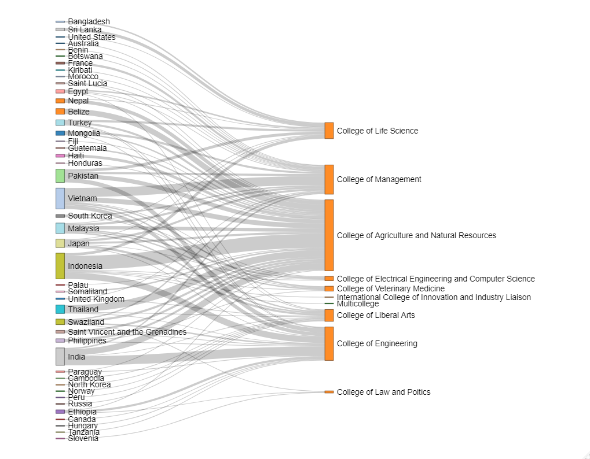
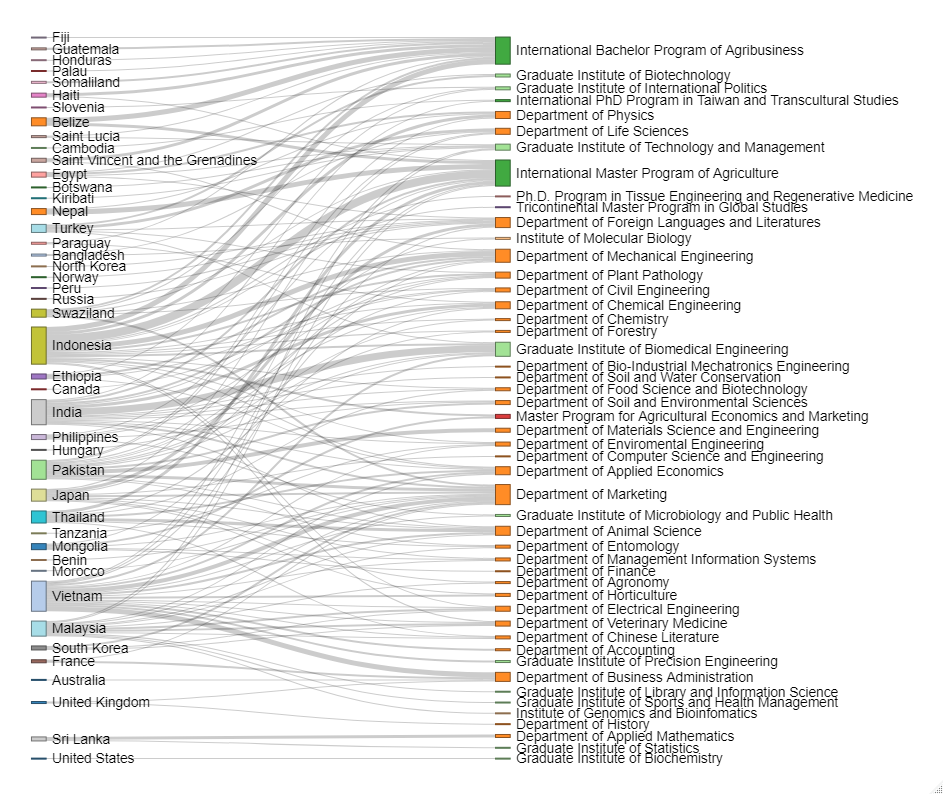
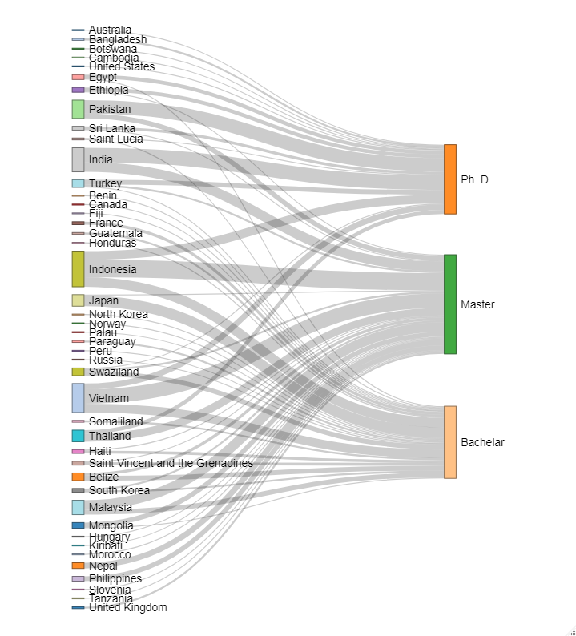
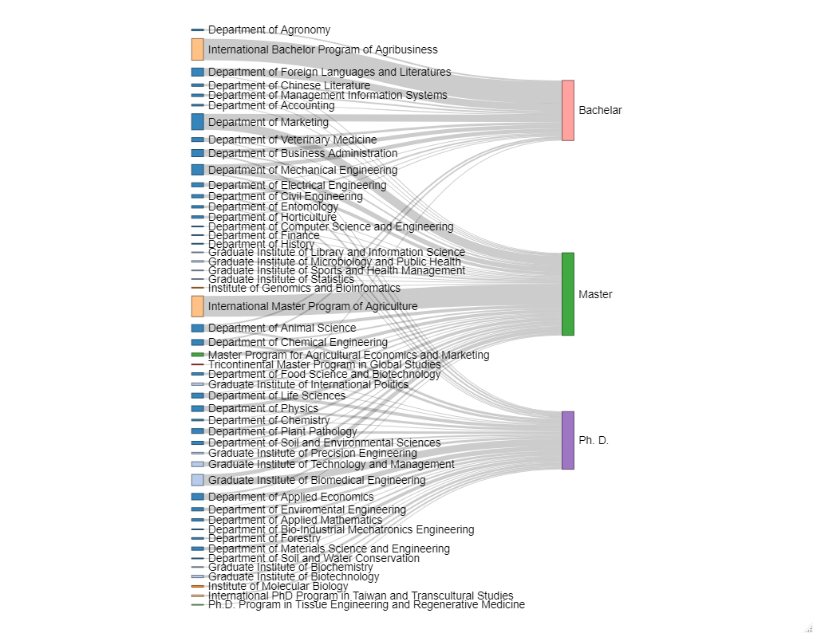

```{r setup, include=FALSE}
knitr::opts_chunk$set(echo = TRUE)
options(tibble.print_max = Inf)
library(xlsx)
library(tidyverse)
library(ggplot2)
library(treemap)
library(networkD3)
```

## Analysis of application data from new students

### Import data

```{r}
dataset <- read.xlsx("application_data.xlsx","Sheet1",header=TRUE)
```

Inspect data structure

```{r}
str(dataset)
```

### Descriptive analysis

By nationality

```{r}
dataset %>%
  count(Nationality, sort=TRUE) %>%
  mutate(Nationality=paste(Nationality,n,sep="\n")) %>%
  treemap(index="Nationality",
      vSize="n", title="Nationality"
  )

dataset %>%
  group_by(Nationality) %>%
  summarise(count = n()) %>%
  arrange(desc(count)) %>%
  mutate( proportion = count / sum(count) * 100 )
```

By college

```{r}
dataset %>%
  count(College, sort=TRUE) %>%
  mutate(College=str_remove(College,"College of ")) %>%
  mutate(College=paste(College,n,sep="\n")) %>%
  treemap(index="College",
      vSize="n", title="College"
  )
dataset %>%
  group_by(College) %>%
  summarise(count = n()) %>%
  arrange(desc(count)) %>%
  mutate( proportion = count / sum(count) * 100 )

```

By department

```{r}
dataset %>%
  count(Department, sort=TRUE) %>%
  mutate(Department=str_remove(Department,"Department of ")) %>%
  mutate(Department=paste(Department,n,sep="\n")) %>%
  treemap(index="Department",
      vSize="n", title="Department"
  )
dataset %>%
  group_by(Department) %>%
  summarise(count = n()) %>%
  arrange(desc(count)) %>%
  mutate( proportion = count / sum(count) * 100 )

```

By degree

```{r}
dataset %>%
  count(Degree, sort=TRUE) %>%
  mutate(Degree=paste(Degree,n,sep="\n")) %>%
  treemap(index="Degree",
      vSize="n", title="Degree"
  )
dataset %>%
  group_by(Degree) %>%
  summarise(count = n()) %>%
  arrange(desc(count)) %>%
  mutate( proportion = count / sum(count) * 100 )

```


#### Relation analysis

Relation between nationality and college

```{r echo=FALSE}

```

Relation between nationality and department

```{r echo=FALSE}

```

Relation between nationality and degree

```{r echo=FALSE}

```

Relation between department and degree

```{r echo=FALSE}

```


